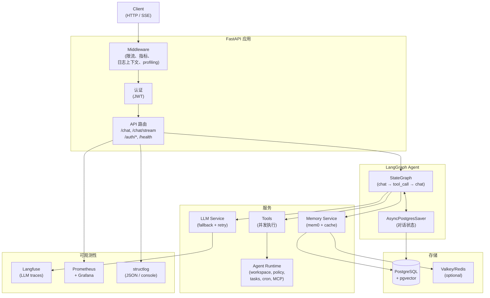
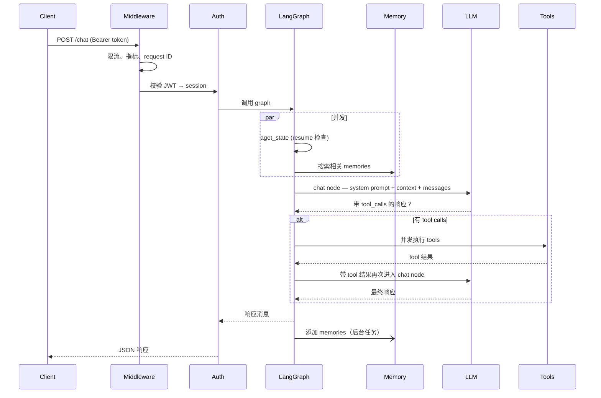
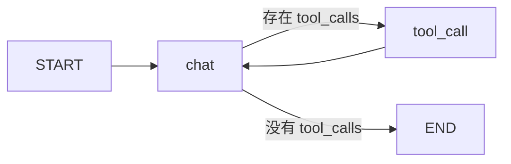

# 架构

## 系统概览

## 请求生命周期

## Agent graph

Agent 是一个双节点 `StateGraph`：

- **`chat` node**：构建 system prompt，调用 LLM，返回路由到 `tool_call` 或 `END` 的 `Command`
- **`tool_call` node**：并发执行全部 tool calls，并把结果送回 `chat`
- **Checkpointer**：`AsyncPostgresSaver` 按 `thread_id`（session）持久化完整 `GraphState`，支持 interrupt 后恢复和多轮记忆

## 关键设计决策

**Memory search 和状态检查并发执行。** 对每个非恢复请求，`aget_state`（检查 interrupts）和 `memory.search`（获取相关 memories）会通过 `asyncio.gather` 并行运行，每个请求节省约 200-500ms。

**Tool calls 并发执行。** 当 LLM 在一次响应中返回多个 tool calls 时，它们会通过 `asyncio.gather` 并行执行。

**Tool Policy 统一审批。** Agent runtime tools 默认暴露给聊天 Agent，但 shell、写文件、worktree、cron、teammate 和 destructive MCP 工具在执行前会先经过 Tool Policy。需要人工确认时，graph 使用 LangGraph interrupt 暂停，并在用户恢复后继续或拒绝该工具调用。

**Agent runtime 状态进 Postgres。** task、worktree、job、cron、teammate、message、approval、MCP server 和 runtime event 都按 `user_id + session_id` 隔离。workspace 文件、skills 和 project memory 仍保留在 `AGENT_WORKSPACE_ROOT` 下，便于人工审阅。

**System prompt 在模块加载时缓存。** `system.md` 在启动时只读取一次。每个请求只需要用用户名、当前时间和检索到的 memories 执行 `.format()`，没有额外文件 I/O。

**LLM fallback 有总超时。** 整个 fallback loop（重试次数 x 模型数）包在 `asyncio.wait_for(timeout=LLM_TOTAL_TIMEOUT)` 中，避免无限挂起。

**Username 通过 session 流转，而不是每个请求查库。** 用户展示名会在创建 session 时复制到 `Session.username`。聊天请求直接从已加载的 session 对象读取它，不产生额外查询。

**Session 标题生成不增加主请求延迟。** 未命名 session 收到第一条消息时，API 会用占位名称（用户消息截断版）原子认领 session，然后启动后台 `asyncio.Task` 调用快速 nano 模型并使用结构化输出生成正式标题。主聊天响应会立即返回，标题生成并发执行。Postgres 中的原子 `UPDATE ... WHERE name = ''` 确保即使并发请求出现，也只有一个 worker 赢得认领。

## 组件职责

| 组件 | 文件 | 职责 |
|---|---|---|
| LangGraph Agent | `app/core/langgraph/graph.py` | 编排对话循环 |
| LLM Service | `app/services/llm/` | 模型注册表、重试、循环 fallback、结构化输出 |
| Memory Service | `app/services/memory.py` | mem0 语义记忆 + 缓存 |
| Agent Runtime | `app/agent_runtime/` | workspace 工具、Tool Policy、task、cron、MCP、skills、project memory |
| Session Naming | `app/services/session_naming.py` | 为新 session 后台生成 LLM 标题 |
| Database Service | `app/services/database.py` | User/session CRUD |
| Cache Service | `app/core/cache.py` | Valkey/Redis，以及内存 fallback |
| Middleware | `app/core/middleware.py` | 指标、日志上下文、profiling |
| Auth | `app/api/v1/auth.py` | JWT 创建、session 管理 |
