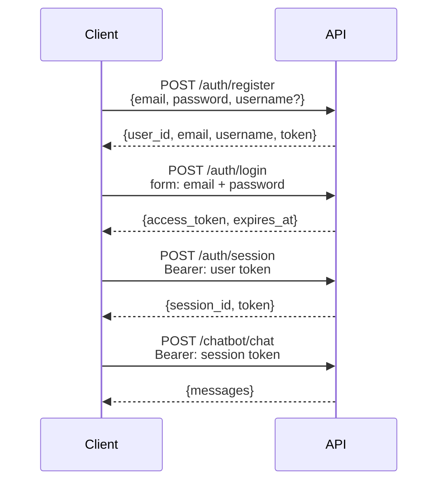

# 认证

## 流程



API 使用**两种 token 作用域**：

- **User token**：注册/登录时签发，用于识别用户。用于创建和列出 sessions。
- **Session token**：每个对话 session 单独签发。所有聊天端点都需要它，作用域限定在单个 `session_id`。

二者都是使用 HS256 签名的 JWT，过期时间可通过 `JWT_ACCESS_TOKEN_EXPIRE_DAYS` 配置。

---

## 端点

### `POST /api/v1/auth/register`

创建新账号。

```json
{
  "email": "you@example.com",
  "password": "Secret123!",  // pragma: allowlist secret
  "username": "you"
}
```

密码要求：至少 8 个字符，包含大写字母、小写字母、数字和特殊字符。

`username` 可选。提供后，它会传入 agent 的 system prompt，让 LLM 知道用户名称。

---

### `POST /api/v1/auth/login`

用凭据换取 user token。该端点使用 OAuth2 password grant form fields。

```bash
curl -X POST /api/v1/auth/login \
  -F "email=you@example.com" \
  -F "password=Secret123!" \
  -F "grant_type=password"
```

返回 `access_token` 和 `expires_at`。

---

### `POST /api/v1/auth/session`

创建新的聊天 session。需要有效 user token。

```bash
curl -X POST /api/v1/auth/session \
  -H "Authorization: Bearer <user token>"
```

返回 `session_id` 和限定在该 session 的 `token`。后续所有聊天请求都使用这个 session token。

---

### `PATCH /api/v1/auth/session/{session_id}/name`

重命名 session。

```bash
curl -X PATCH /api/v1/auth/session/{session_id}/name \
  -H "Authorization: Bearer <session token>" \
  -F "name=My research session"
```

---

### `DELETE /api/v1/auth/session/{session_id}`

删除 session 及其聊天历史。

---

### `GET /api/v1/auth/sessions`

列出已认证用户的所有 sessions。需要 user token。

---

## 安全说明

- 密码存储前会使用 bcrypt 哈希，绝不持久化明文。
- JWT 包含 `jti`（JWT ID）claim，用于保证 token 唯一性。
- 所有字符串输入在使用前都会清洗。
- register（10/hour）和 login（20/min）端点有速率限制，用于防护暴力破解。
- 生产环境应设置长随机 `JWT_SECRET_KEY`，至少 32 个字符。
