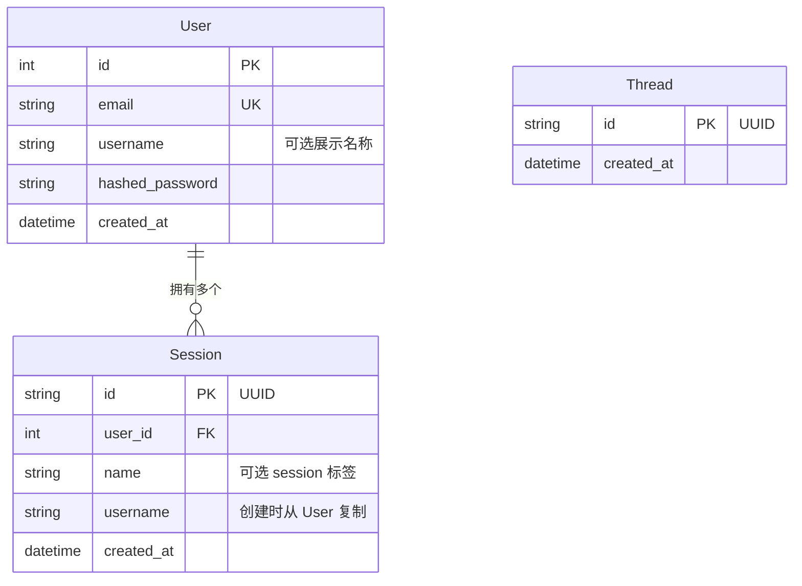

# 数据库与迁移

## Schema



**User**：每个账号一条记录。Email 唯一。`username` 可选，用于个性化 system prompt。

**Session**：每段对话一条记录。一个用户可以拥有多个 sessions。`username` 在创建时从 `User` 反规范化复制过来，这样聊天请求不需要额外查询数据库。session JWT 用于限定所有聊天请求的作用域。

**Thread**：映射 LangGraph 的 `AsyncPostgresSaver` checkpoint thread，用来记录应用上下文中有哪些 threads。

LangGraph checkpointer 也会创建自己的表（`checkpoints`、`checkpoint_blobs`、`checkpoint_writes`），这些表由 LangGraph 自己管理，不由 Alembic 管理。

pgvector 会创建由 mem0 管理的 `longterm_memory` collection 表，同样不由 Alembic 管理。

---

## 使用 Alembic 做迁移

所有 schema 变更都通过 Alembic 管理。应用启动时不再调用 `create_all()`，schema 由 Alembic 负责。

### 初始化设置（全新数据库）

```bash
make migrate              # 将所有迁移应用到数据库
```

### 模型变更后创建迁移

```bash
# 1. 编辑 SQLModel model（app/models/）
# 2. 生成迁移
make migration MSG="add phone number to user"

# 3. 审查 alembic/versions/ 下生成的文件
# 4. 应用迁移
make migrate
```

### 其他命令

```bash
make migrate-downgrade    # 回滚上一次迁移
make migrate-history      # 查看完整迁移历史
```

Alembic 会通过 `app/core/config.py` 从 `.env` 文件读取数据库凭据。运行迁移前，请确认已经设置正确的 `APP_ENV`。

### autogenerate 如何工作

`env.py` 会导入所有 SQLModel models，使 metadata 完成注册，然后调用 `alembic revision --autogenerate`。Alembic 会对比当前数据库 schema 和 models，并生成 upgrade/downgrade 函数。

外部系统表（LangGraph checkpointer、mem0、pgvector）会通过 `alembic/env.py` 中的 `include_object` 排除，因此 Alembic 不会触碰它们。

### 添加新 model

1. 创建 `app/models/your_model.py`
2. 在 `alembic/env.py` 中和其他 model 一起导入它
3. 运行 `make migration MSG="add your_model table"`

---

## 为全新数据库添加 pgvector

运行迁移前必须启用 pgvector：

```sql
CREATE EXTENSION IF NOT EXISTS vector;
```

使用 Docker（`make docker-up`）时，`db` 服务会自动处理。对于外部数据库（例如 Supabase），请通过 dashboard 或 SQL editor 启用该 extension。
