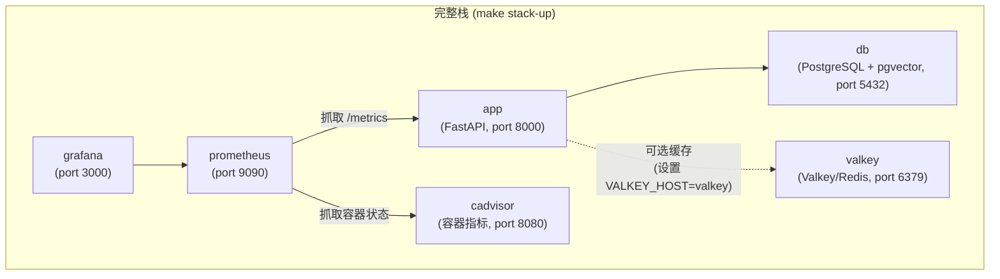

# Docker

## Services



Valkey 会始终启动，但只有在 `.env` 文件中设置 `VALKEY_HOST=valkey` 时，应用才会使用它。未设置时，应用会回退到内存缓存。

## 命令

Makefile 默认使用 Docker Compose v2（`docker compose`）。如果你的机器只有旧版独立二进制文件，请在 make 命令中传入 `DOCKER_COMPOSE=docker-compose`。

### 只启动 API + 数据库（开发时最常用）

```bash
make docker-up ENV=development     # 启动
make docker-down ENV=development   # 停止
make docker-logs ENV=development   # 跟踪日志
```

### 完整栈（包含 Prometheus + Grafana）

```bash
make stack-up ENV=development      # 启动全部服务
make stack-down ENV=development    # 停止全部服务
make stack-logs ENV=development    # 跟踪所有服务日志
```

### 构建自定义镜像

```bash
make docker-build ENV=production
```

该命令会运行 `scripts/build-docker.sh`，为指定环境构建并打 tag。

## 在 Docker 环境中运行迁移

执行 `make docker-up` 后，对容器内数据库运行迁移：

```bash
make migrate ENV=development
```

该命令会加载正确的 `.env` 文件，并从本机运行 `alembic upgrade head`，连接到容器内 PostgreSQL。

## 环境文件

每个环境都需要一个 `.env.<env>` 文件：

```bash
cp .env.example .env.development
cp .env.example .env.staging
cp .env.example .env.production
```

`docker-up` 和 `stack-up` 命令会通过 `--env-file` 把 env 文件传给 Docker Compose。请确认 Docker env 文件里设置的是 `POSTGRES_HOST=db`，不是 `localhost`；Compose 网络内的服务名是 `db`。

## Grafana

执行 `make stack-up` 后，可以在 [http://localhost:3000](http://localhost:3000) 访问 Grafana。

默认账号密码：`admin` / `admin`

预配置 dashboard 位于 `grafana/`，包括：

- API 性能（请求速率、延迟、错误率）
- 限流统计
- 数据库连接池健康状态
- 系统资源使用情况
