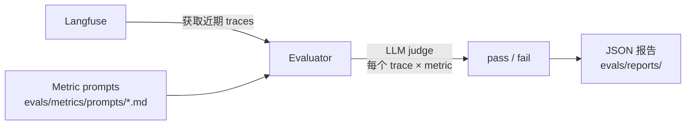

# 评测

本模板包含一个基于指标的评测框架：它会从 Langfuse 获取 traces，用 LLM judge 打分，并生成 JSON 报告。

## 运行评测

```bash
make eval                        # 交互模式，会提示配置项
make eval-quick                  # 使用默认值运行，不显示 prompt
make eval-no-report              # 运行评测但跳过报告生成
make eval ENV=production         # 针对 production traces 运行
```

## 工作方式



1. **获取 traces**：从 Langfuse 拉取近期 LLM traces（通过 `LANGFUSE_*` 环境变量配置）
2. **评分**：对每个 trace x metric 组合，由 LLM judge 评测输出并返回 pass/fail
3. **报告**：将聚合统计和每条 trace 的结果保存为 JSON 报告，路径为 `evals/reports/`

## 内置指标

| 指标 | 检查内容 |
| --- | --- |
| `helpfulness` | 响应是否真正帮助了用户 |
| `conciseness` | 响应是否足够简洁 |
| `hallucination` | 响应是否包含编造事实 |
| `relevancy` | 响应是否围绕主题 |
| `toxicity` | 响应是否包含有害内容 |

## 添加自定义指标

1. 在 `evals/metrics/prompts/` 中创建 markdown 文件：

```markdown
# 我的指标

评估 assistant 响应是否...

## 评分

如果...返回 "pass"；如果...返回 "fail"。
```

2. 评测器会自动发现并应用该目录下的所有 `.md` 文件。

## 报告格式

报告会保存到 `evals/reports/evaluation_report_YYYYMMDD_HHMMSS.json`：

```json
{
  "summary": {
    "total_traces": 50,
    "success_rate": 0.92,
    "duration_seconds": 34.2
  },
  "metrics": {
    "helpfulness": {"pass": 48, "fail": 2, "rate": 0.96},
    "hallucination": {"pass": 45, "fail": 5, "rate": 0.90}
  },
  "traces": [...]
}
```

## 评测 LLM 配置

评测器使用独立 LLM 配置，因此可以使用不同的、更便宜的模型做 judge：

```bash
EVALUATION_LLM=gpt-5
EVALUATION_API_KEY=...   # 未设置时默认使用 OPENAI_API_KEY
```
