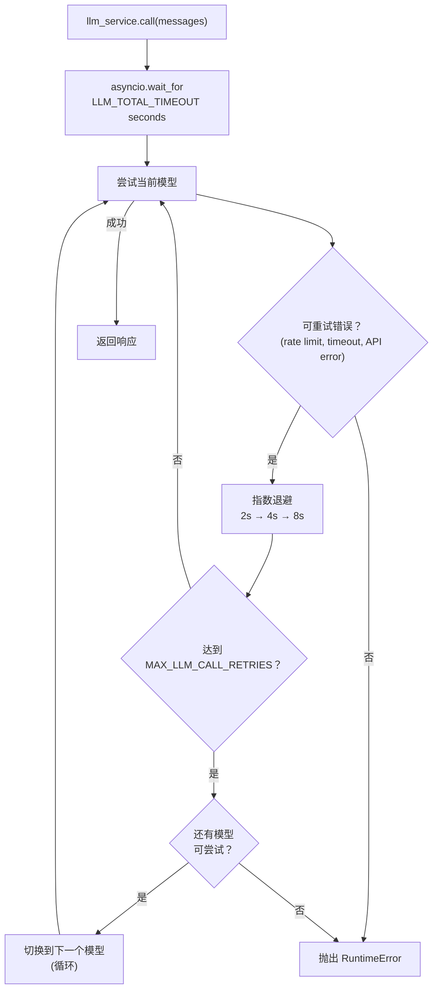

# LLM Service

## 概览

LLM service（`app/services/llm/`）负责所有语言模型调用，包括自动重试、循环模型 fallback 和总超时预算。Agent 代码只需要调用 `llm_service.call(messages)`，其余逻辑由 service 处理。

该包拆分为两个模块：

- `app/services/llm/registry.py`：`LLMRegistry`，定义可用模型
- `app/services/llm/service.py`：`LLMService`，处理调用逻辑、重试、fallback 和结构化输出

## 模型注册表

模型按优先级顺序定义在 `LLMRegistry.LLMS` 中：

| 名称 | 模型 | 说明 |
| -------------- | ------------ | -------------------------------------- |
| `gpt-5-mini` | gpt-5-mini | 默认模型，低 reasoning effort。 |
| `gpt-5.4` | gpt-5 | 中等 reasoning effort。 |
| `gpt-5.4-nano` | gpt-5.4-nano | 快速模型，低 reasoning effort。 |
| `gpt-5` | gpt-5 | 完整模型，采样参数针对生产环境调整。 |

在 `.env` 中设置 `DEFAULT_LLM_MODEL` 可选择起始模型。使用 OpenAI-compatible provider 时，设置 `OPENAI_BASE_URL`。

如需新增或修改模型，编辑 `app/services/llm/registry.py` 中的 `LLMRegistry.LLMS`。

## 重试和 fallback 行为



**重试配置**（单个模型维度）：

- 最大尝试次数：`MAX_LLM_CALL_RETRIES`（默认 3）
- 等待策略：指数退避，最小 2s，最大 10s
- 重试错误：`RateLimitError`、`APITimeoutError`、`APIError`

**总超时**：`LLM_TOTAL_TIMEOUT` 秒（默认 60s）限制整个循环。没有它时，最坏情况是 `retries × models × max_wait`，可能超过 2 分钟。

**Fallback 顺序**：按 `LLMRegistry.LLMS` 循环尝试。最后一个模型之后回到第一个模型，完整循环一轮后停止。

## Tools

启动时会把 tools 绑定到 LLM：

```python
llm_service.bind_tools(tools)
```

fallback 过程中切换模型时，tools 会自动重新绑定到新模型。

## 结构化输出

将 Pydantic model 作为 `response_format` 传入，可以得到校验后的实例，而不是原始 `BaseMessage`：

```python
from app.schemas.my_schema import MySchema

result: MySchema = await llm_service.call(
    messages,
    model_name="gpt-5.4-nano",   # 可选；省略时使用当前默认模型
    response_format=MySchema,
    temperature=0.2,
)
```

service 会在解析出的模型上串接 `.with_structured_output(schema)`，并在每次 fallback 尝试时重新包装，因此重试和模型切换对调用方透明。

## 添加新模型

```python
# app/services/llm/registry.py — LLMRegistry.LLMS
{
    "name": "gpt-5.4",
    "llm": ChatOpenAI(
        model="gpt-5.4",
        api_key=settings.OPENAI_API_KEY,
        max_tokens=settings.MAX_TOKENS,
    ),
},
```

可以把新模型加到列表中的任意位置。fallback 顺序遵循列表顺序。
