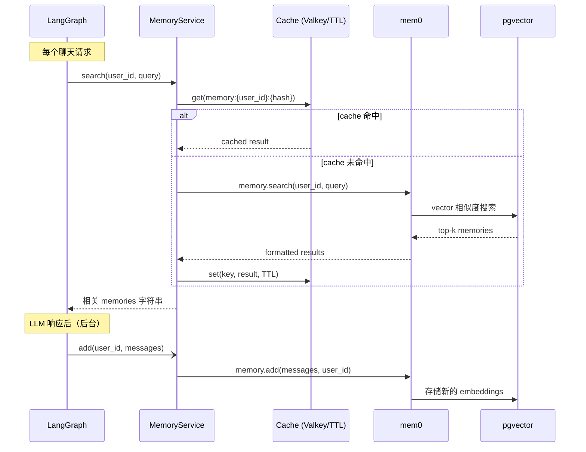

# 记忆

## 概览

本模板包含一个由 [mem0](https://github.com/mem0ai/mem0) 和 pgvector 驱动的长期记忆系统。系统会从对话中提取 memories，以 vector embeddings 的形式存储，并在每次请求时通过语义搜索取回相关内容，为 agent 提供过去 sessions 的上下文。

## 工作方式

## 缓存层

Memory search 结果会被缓存，避免在同一个 TTL 窗口内对相似问题重复查询 pgvector。

- **使用 Valkey/Redis**：缓存会在多个应用实例间共享。请在 `.env` 中设置 `VALKEY_HOST`。
- **不使用 Valkey**：回退到内存 `TTLCache`，适合单实例运行。

Cache key：`memory:{user_id}:{sha256(query)[:16]}`
TTL: `CACHE_TTL_SECONDS` (default: 60s)

只缓存成功且非空的结果，错误结果永远不会缓存。

## 记忆更新

LLM 生成响应后，memories 会通过 `asyncio.create_task` **在后台**更新。这意味着：
- 响应会立即返回，不等待 mem0 完成
- 记忆更新不会阻塞或拖慢聊天响应

## 配置

| 变量 | 默认值 | 说明 |
| --- | --- | --- |
| `LONG_TERM_MEMORY_ENABLED` | `true` | 是否启用长期记忆 |
| `LONG_TERM_MEMORY_COLLECTION_NAME` | `longterm_memory` | pgvector collection 名称 |
| `LONG_TERM_MEMORY_LLM_PROVIDER` | `openai` | mem0 提取 memories 使用的 LLM provider |
| `LONG_TERM_MEMORY_MODEL` | `DEFAULT_LLM_MODEL` | mem0 用于提取和处理 memories 的 LLM |
| `LONG_TERM_MEMORY_BASE_URL` | `OPENAI_BASE_URL` | 长期记忆 LLM 的 OpenAI-compatible endpoint |
| `LONG_TERM_MEMORY_EMBEDDER_PROVIDER` | `openai` | 语义搜索使用的 embedding provider |
| `LONG_TERM_MEMORY_EMBEDDER_MODEL` | `text-embedding-3-small` | 语义搜索使用的 embedding 模型 |
| `LONG_TERM_MEMORY_EMBEDDER_BASE_URL` | `OPENAI_BASE_URL` | embedding provider 的 OpenAI-compatible endpoint |
| `CACHE_TTL_SECONDS` | `60` | Memory search 缓存 TTL |

如果主聊天 provider 不支持 embeddings，可以设置 `LONG_TERM_MEMORY_ENABLED=false` 先关闭长期记忆；或者用 `LONG_TERM_MEMORY_EMBEDDER_*` 单独指定支持 embeddings 的 provider。

## 启动预热

启动时，应用 lifespan 会调用 `memory_service.initialize()`。这会建立 pgvector 连接池并执行 mem0 schema 检查，避免第一个用户请求承担约 130ms 的冷启动成本。

## 用户隔离

每个用户的 memories 都以 `user_id` 作为 namespace 独立存储和搜索。用户无法访问彼此的 memories。
