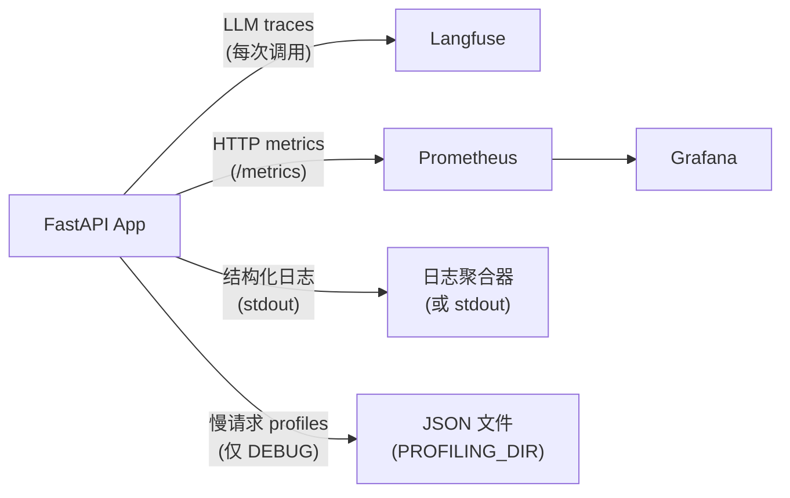

# 可观测性

## 概览



---

## Langfuse：LLM tracing

每次 LLM 调用都会通过 LangChain `CallbackHandler` 记录 trace。Trace 包含：

- 输入消息和输出
- token 使用量和成本
- 单次调用和单个 session 的延迟
- 模型名、temperature 和其他参数

**设置：**

```bash
LANGFUSE_TRACING_ENABLED=true
LANGFUSE_PUBLIC_KEY=pk-...
LANGFUSE_SECRET_KEY=sk-...
LANGFUSE_HOST=https://cloud.langfuse.com   # 或你的 self-hosted URL
```

**本地开发禁用：**

```bash
LANGFUSE_TRACING_ENABLED=false
```

Traces 也会作为 [评测框架](evaluation.md) 的数据源。

---

## 结构化日志

所有日志都使用 [structlog](https://www.structlog.org/)，并保持一致格式：

- **Development**：彩色控制台输出
- **Production**：JSON，可接入日志聚合器

每条日志会在可用时自动携带 `request_id`、`session_id` 和 `user_id`，这些字段由 `LoggingContextMiddleware` 绑定。

### 日志格式约定

```python
# 推荐
logger.info("chat_request_received", session_id=session.id, message_count=5)

# 不要这样写
logger.info(f"chat request received for {session.id}")  # 不要使用 f-strings
logger.error("something failed", error=str(e))          # exception 场景使用 logger.exception
```

规则：

- Event name 使用 `lowercase_with_underscores`
- 变量通过 keyword arguments 传入，不要插入 event string
- 在 `except` 块中使用 `logger.exception()`，不要用 `.error()`，这样可以保留完整 traceback

### 按环境区分的日志级别

| 环境 | 级别 |
| --- | --- |
| development | DEBUG |
| staging | INFO |
| production | WARNING |

---

## Prometheus 指标

指标通过 `GET /metrics` 暴露，并由 Prometheus 抓取。

| 指标 | 类型 | 说明 |
| --- | --- | --- |
| `http_requests_total` | Counter | 按 method、endpoint、status 统计请求数 |
| `http_request_duration_seconds` | Histogram | 按 method、endpoint 统计请求延迟 |
| `llm_inference_duration_seconds` | Histogram | 按 model 统计 LLM 调用延迟 |
| `llm_stream_duration_seconds` | Histogram | 按 model 统计流式调用延迟 |
| `db_connections` | Gauge | 活跃数据库连接数 |

`grafana/` 中已预配置 Grafana dashboards。使用 `make stack-up ENV=development` 启动完整栈后，可在 [http://localhost:3000](http://localhost:3000) 访问，默认账号密码为 admin/admin。

---

## 请求 profiling（仅 debug）

当 `DEBUG=true` 时，`ProfilingMiddleware` 会使用 [pyinstrument](https://github.com/joerick/pyinstrument) 对每个请求做 profiling。请求耗时超过 `PROFILING_THRESHOLD_SECONDS` 时，会将 JSON 报告保存到 `PROFILING_DIR`。

每个报告文件命名为 `{request_id}.json`，内容包括：

```json
{
  "request_id": "...",
  "endpoint": "POST /api/v1/chatbot/chat",
  "wall_time_ms": 1842,
  "cpu_time_ms": 145,
  "io_wait_ms": 1697,
  "memory_peak_kb": 4820,
  "top_memory_allocators": [...],
  "call_tree": {...}
}
```

设置 `PROFILING_THRESHOLD_SECONDS=0` 可记录每个请求。

文件名中的 `request_id` 与响应 header `X-Request-ID` 一致，因此可以把 profile 和具体日志行关联起来。

---

## Request ID 传播

每个请求都会通过 [`asgi-correlation-id`](https://github.com/snok/asgi-correlation-id) 获得唯一 `X-Request-ID` header。该 ID 会：

- 返回在响应 headers 中
- 绑定到该请求的每条日志
- 用作 profile 报告文件名

可以使用响应中的 `X-Request-ID` grep 日志、查找 profile，并定位该请求对应的 Langfuse trace。
